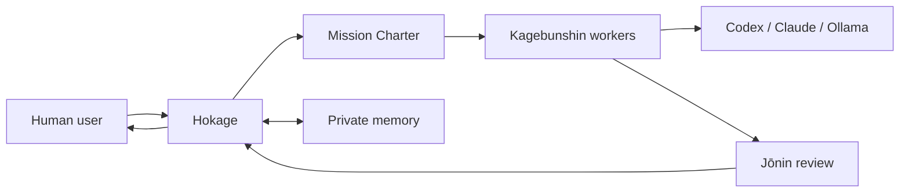
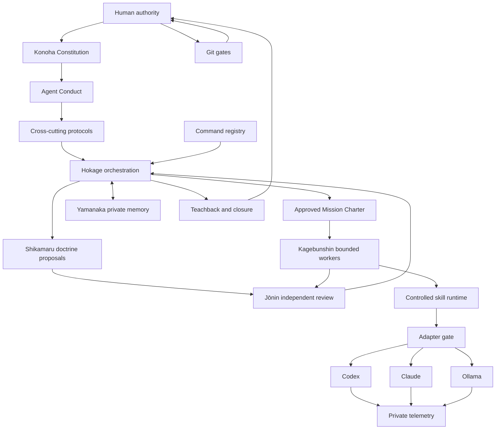

# Konoha Agentic Academy

**Konoha is a local-first, terminal-first operating framework for supervised AI missions.**

It coordinates humans, agents, models, tools, memory and Git operations under an explicit Constitution. Konoha does not replace human authority: it turns intent into a Mission Charter, proposes a bounded strategy, requests approval, executes through controlled gates, reviews evidence and records continuity privately.



## What Konoha does

- Starts from a single terminal entry point: `konoha`.
- Detects first use and reentry.
- Creates a supervised, Git-ignored private village when approved.
- Inspects CPU, RAM, disk, GPU and local Ollama models.
- Detects Codex, Claude and Ollama readiness.
- Builds a Provider Capacity Snapshot.
- Classifies missions and proposes a provider, model and strategy.
- Estimates token usage and targets at least 30% savings.
- Produces a Mission Charter before execution.
- Keeps Charter, action, review, Teachback, Git and release approvals separate.
- Stores continuity, telemetry and memory only in private ignored paths.

## What Konoha deliberately does not do

- It does not execute autonomously.
- It does not self-approve.
- It does not modify its own doctrine.
- It does not treat model output as truth.
- It does not let memory authorize action.
- It does not bypass Git gates.
- It does not expose private village data in the public repository.
- It does not make providers responsible for strategy.

## Prime doctrine

```text
No assumptions.
Explicit > inferred.
Ask > assume.
Stop > improvise.
Evidence before action.
Mission Charter before execution.
Command proposals are not permission.
Model output is evidence only.
Memory supports action but does not authorize action.
Summaries are not truth.
Safety overrides autonomy.
```

## Install

Requirements:

- Python 3.10 or newer.
- Git.
- WSL/Linux/macOS shell.
- Optional provider CLIs: Codex, Claude and Ollama.

Editable development install:

```bash
cd /path/to/konoha-agentic-academy
python -m venv alliance/kirigakure/.venv-wsl
source alliance/kirigakure/.venv-wsl/bin/activate
python -m pip install --upgrade pip setuptools wheel
python -m pip install -e .
konoha --version
```

Managed installation:

```bash
bash scripts/install.sh \
  --version v3.6.0 \
  --confirm-install \
  --approval-token INSTALL_KONOHA_CLI
```

## First run

```bash
konoha
```

On first run, Konoha:

1. inspects the current environment;
2. reports provider readiness;
3. inspects local hardware and Ollama models;
4. proposes a private village if one is missing;
5. shows the exact approval phrase required to create it;
6. enters the Conversational Hokage.

A private village is never created unless:

- the human provides the exact approval phrase; and
- the target path is already ignored by Git.

Default private structure:

```text
alliance/kirigakure/
├── state/
├── memory/
├── telemetry/
├── budgets/
├── handoffs/
├── reports/
└── evals/
```

## Mission flow

```text
Request
  -> Intent interpretation
  -> Mission classification
  -> Provider/model proposal
  -> Strategy and economy estimate
  -> Mission Charter proposal
  -> Human Charter approval
  -> Bounded action proposal
  -> Human action approval
  -> Provider/tool execution
  -> Jōnin review
  -> Human review approval
  -> Teachback
  -> Human closure
  -> Private continuity
```

## Detailed architecture



### Authority boundaries

- **Human user:** final approval authority.
- **Hokage:** interprets intent, proposes strategy and coordinates; does not execute.
- **Kagebunshin:** executes one bounded assignment.
- **Jōnin:** reviews independently; does not approve its own work.
- **Shikamaru:** drafts doctrine deltas; cannot apply or approve them.
- **Yamanaka:** stores and retrieves evidence; memory is not permission.
- **Providers:** replaceable executors; they do not decide strategy.

See:

- `core/laws/KONOHA_LAWS.md`
- `core/laws/CONSTITUTIONAL_REGISTRY.json`
- `docs/architecture/authority_and_role_boundaries.md`

## Provider economy

Konoha detects provider readiness and records explicit evidence:

- installed or missing;
- authenticated or authentication required;
- usage source;
- limit source;
- renewal source;
- local model inventory;
- recommended local profile.

When subscription limits or renewal dates are unavailable, Konoha marks them as `manual_required`. It does not invent billing data.

## Security and privacy

Public commits must not contain credentials, `.env` files, tokens, client data, work email, local memory, private reports or provider transcripts.

Private data belongs in ignored paths such as:

```text
alliance/kirigakure/
alliance/*/private-library/
alliance/*/memory/
vault/
memory/local/
sandbox/
```

## Tests

```bash
python -m unittest discover -s tests/hokage_orchestrator -p "test_*.py"
python -m unittest discover -s tests/konoha_cli -p "test_*.py"
python -m unittest discover -s tests/constitution -p "test_*.py"
python -m unittest discover -s tests/distribution -p "test_*.py"
python tools/version_contract.py
konoha --validate-registry
```

## Documentation

Start with:

- `docs/guides/README.md`
- `docs/guides/v3_6_0_first_run_and_private_village.md`
- `docs/guides/v3_6_0_supervised_mission_runtime.md`
- `docs/architecture/system_overview.md`
- `docs/architecture/authority_and_role_boundaries.md`
- `docs/releases/v3.6.0.md`

## Release status

`v3.6.0` introduces:

- constitutional authority and machine-readable contracts;
- private environment bootstrap and provider capacity snapshots;
- supervised mission classification and decision proposals;
- private village initialization;
- updated onboarding and product documentation.

Konoha remains local-first, terminal-first and explicitly supervised.
